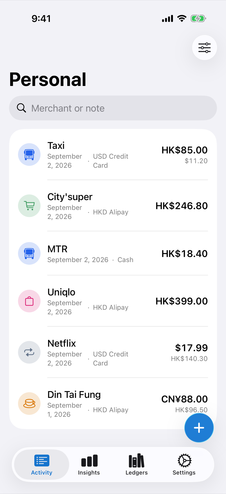
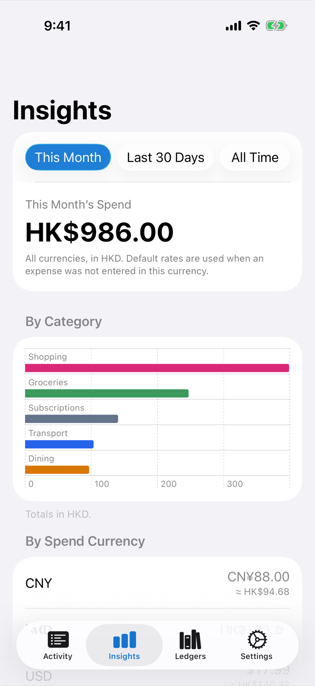
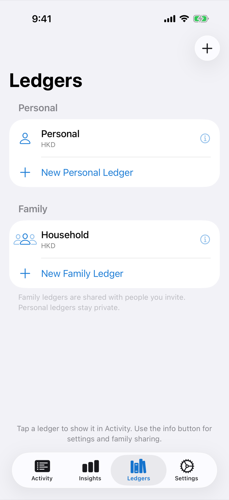
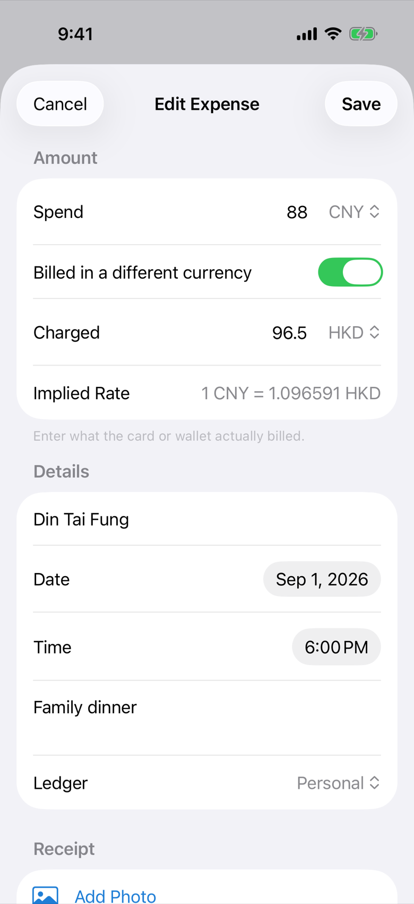
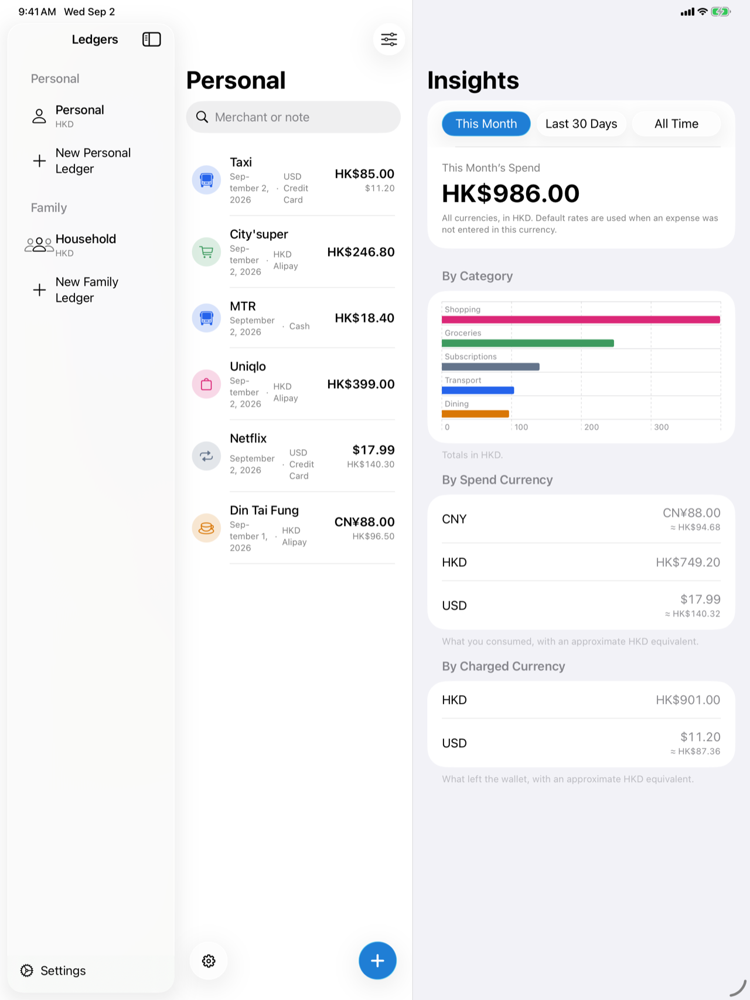
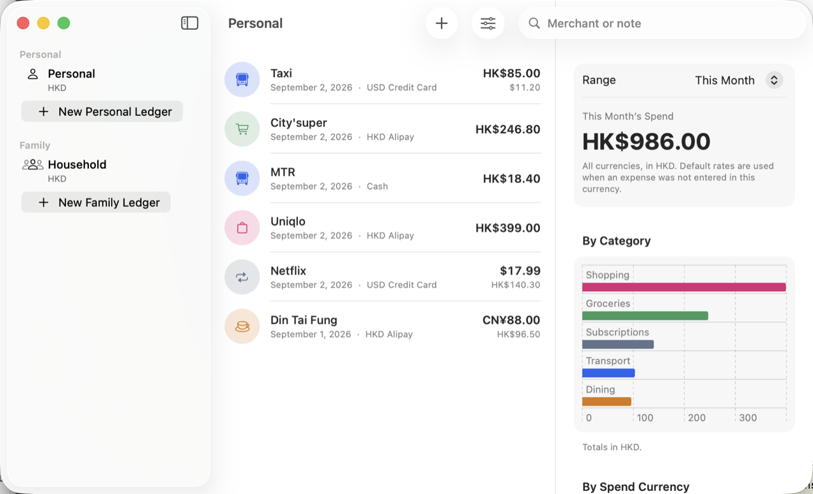

# HowMuch

HowMuch is a personal and household spend tracker for iPhone and Mac. It records the amount consumed, the amount actually charged, and reporting figures for each ledger.

<p align="center">
  
  
  
  
</p>

<p align="center">
  
</p>

<p align="center">
  
</p>

## Data, privacy, and sharing

- Personal ledgers live in the user's private CloudKit database. Family ledgers use a shared CloudKit database and can be invited through the system share sheet; this is not Apple Family Sharing.
- Persistent stores are scoped to a verified iCloud account fingerprint. Without a signed-in iCloud account the app stays usable on a local private store and does not sync or share. Signing in remounts that account's scoped stores; a confirmed account change fully unmounts the previous stores first. Transient iCloud checks keep the last usable data mounted.
- A participant with read-only permission can view a shared ledger but cannot add, edit, delete, reorder, import over, or change its reporting currency.
- Stopping a share keeps the owner's ledger as private data. Leaving a share removes the participant's shared copy after CloudKit confirms the operation. Failed stop/leave operations retain local data and can be retried; they are not treated as success.
- Unshared ledgers can be deleted from ledger settings, the ledger list, or the sidebar. The last personal ledger is kept. A shared family ledger must be stopped (owner) or left (participant) first so a local delete cannot synchronize away the shared graph.
- CloudKit sync is not a backup. Deletions and account changes can synchronize. Export archives regularly and store them separately.

Without CloudKit entitlements, the Debug Mac configuration uses `HowMuch-macOS-local.entitlements` and a local store under the app's Application Support directory. Local mode has no CloudKit account access or sync, but retains sandboxed user-selected read/write access for archive import and export. Enabling a Team later may adopt the legacy private/local store once: a durable base claim binds that retained source to exactly one verified account. Legacy `shared.sqlite` is never adopted automatically and remains available only for explicit recovery, so a later account starts without another account's data.

## Archives and reporting currency

A `.howmuch` file is a portable package containing a manifest, JSON records, CSV expenses, and optional receipts.

- **Merge by UUID** creates missing records and leaves existing matching records unchanged.
- **Import as Copies** creates a complete private copy with new UUIDs.
- **Replace Matching** overwrites matching attributes and receipts and creates missing records. It does not delete records absent from the archive.
- Imports always target the private store. Family sharing relationships and participants are never restored.

Changing a ledger's reporting currency offers two choices. **Keep Historical Values** changes only the ledger currency, preserving stored expense figures. **Recalculate Stored Figures** updates reporting amounts using the app's deterministic default rates; these are approximations, not historical or live market rates. Spend and charged amounts are never changed.

## Requirements and setup

- Xcode 26 or newer
- iOS 18 / macOS 15 deployment targets
- Bundle ID `com.howmuch.app`
- CloudKit container `iCloud.com.howmuch.app`

Open `HowMuch.xcodeproj` and run the shared **HowMuch** scheme. A signed CloudKit build requires an Apple Development team and matching App ID/container capabilities. No development team is stored in the project.

## Tests and CI

Run the complete local CI sequence:

```bash
Scripts/ci.sh
```

It checks source entitlements, runs macOS unit/performance tests, compiles a generic iOS Simulator build, compiles an unsigned macOS Release build, and builds the macOS UI test bundle without running it. Each action uses isolated temporary DerivedData.

Useful focused commands:

```bash
Scripts/check-entitlements.sh source

xcodebuild -project HowMuch.xcodeproj -scheme HowMuch \
  -destination 'platform=macOS' -skip-testing:HowMuchUITests test

xcodebuild -project HowMuch.xcodeproj -scheme HowMuch \
  -destination 'platform=macOS' -only-testing:HowMuchUITests test

Scripts/check-entitlements.sh archive /path/to/HowMuch.xcarchive
```

The GitHub workflow uses the `macos-26` runner and selects its newest installed Xcode without an Xcode setup action. If that runner is unavailable for a repository, run `Scripts/ci.sh` on a self-hosted macOS runner with Xcode 26+.

`-ui-testing` launches an in-memory, sample-data stack and does not initialize CloudKit. UI tests are skipped in the normal macOS unit test action. The iOS accessibility audit is compiled and run only on supported iOS test destinations.

`Scripts/capture-screenshots.sh` rebuilds the README gallery from the iPhone, iPad, and Mac UI.

## Manual release checklist

- [ ] Choose the release Team locally and confirm iPhone device Release uses `HowMuch-iOS-Release.entitlements`.
- [ ] Create signed iOS and macOS Release archives; run `Scripts/check-entitlements.sh archive` on each.
- [ ] Confirm production APS, `iCloud.com.howmuch.app`, CloudKit service, and Mac sandbox/user-selected read-write entitlements in the signed products.
- [ ] Verify CloudKit production schema deployment and fresh install/upgrade migration.
- [ ] Complete the two-account owner/participant flow in `HowMuchTests/CloudSharingTwoAccountTest.md`, including read-only, stop sharing, leave share, offline retry, and retained-data behavior.
- [ ] Test archive export/import with and without receipts, all three import modes, and a separate backup copy.
- [ ] On iOS 26 and macOS 26, test compact/regular layouts, keyboard and VoiceOver navigation, Dynamic Type, share sheets, file import/export, and accessibility audit results.
- [ ] Confirm signed device sync after relaunch and account switching; do not describe CloudKit sync as backup.
- [ ] Delete an extra personal ledger and an unshared family ledger; confirm the last personal ledger and a shared family ledger cannot be deleted in place.
